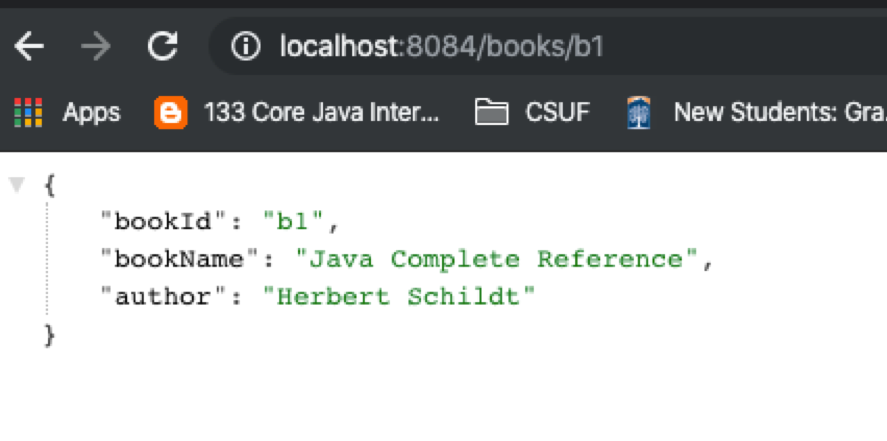
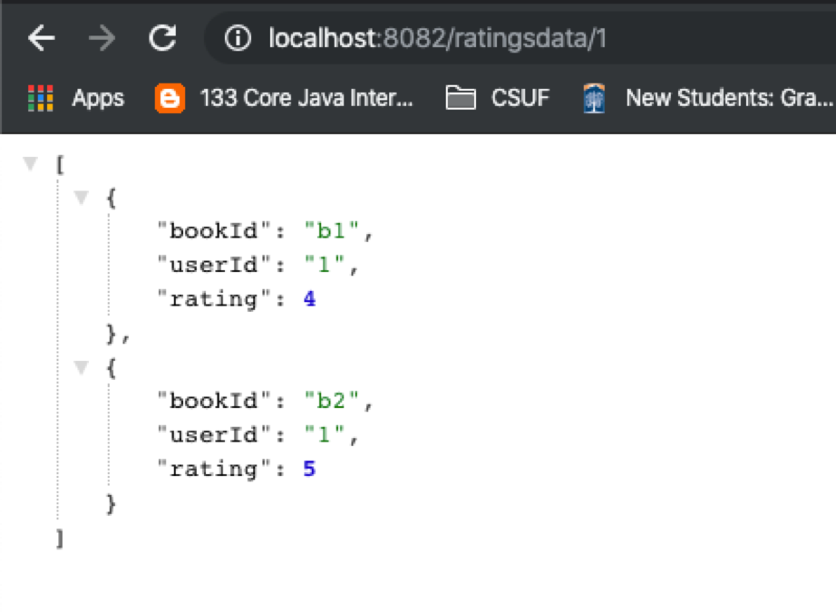
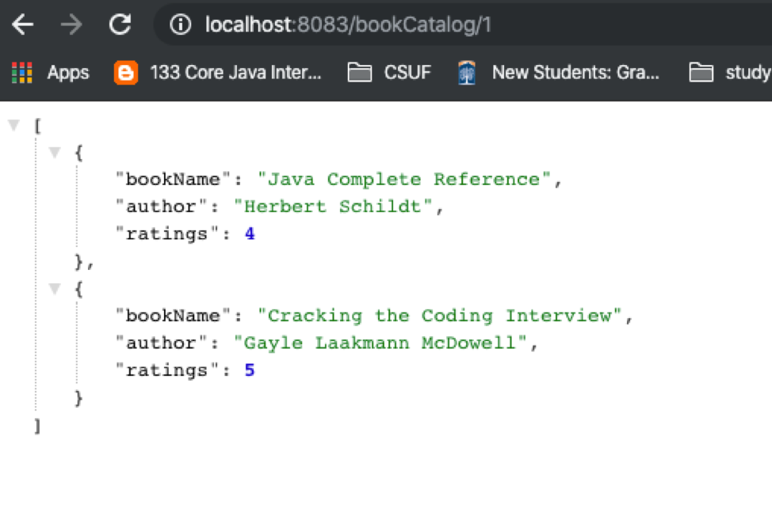

# microsevices-discovery-coomunication-spring-boot-eureka

## Book Info Service:
	Give book id as input and book info service will give you book details like bookId/Isbn number ,book nameand author

## Ratings Data Service:
	Give user id as input and Rating Data service will give you all the books for which this user has given rating.

	

## Book Catalog Service:
Book catalog service calls Rating data service to check what all books this user has read and for each book it calls Book info service to get book details and put all together all these details.

